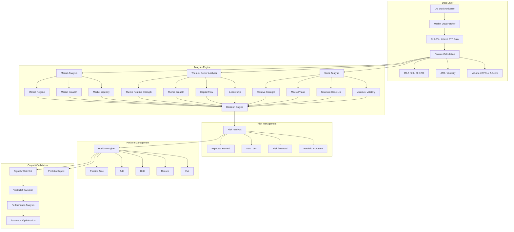

# Quantom Maker — System Architecture

## V1 Architecture Overview

## Design Principle

Quantom Maker separates analysis into three major branches:

- **Market Analysis** — determines the overall market environment.
- **Theme / Sector Analysis** — identifies capital concentration and leading themes.
- **Stock Analysis** — evaluates individual stock strength and price structure.

These branches are analyzed independently and merged by the **Decision Engine**.

The system then separates:

**Analysis → Risk → Position Management → Validation**

to keep signal generation independent from portfolio and risk decisions.